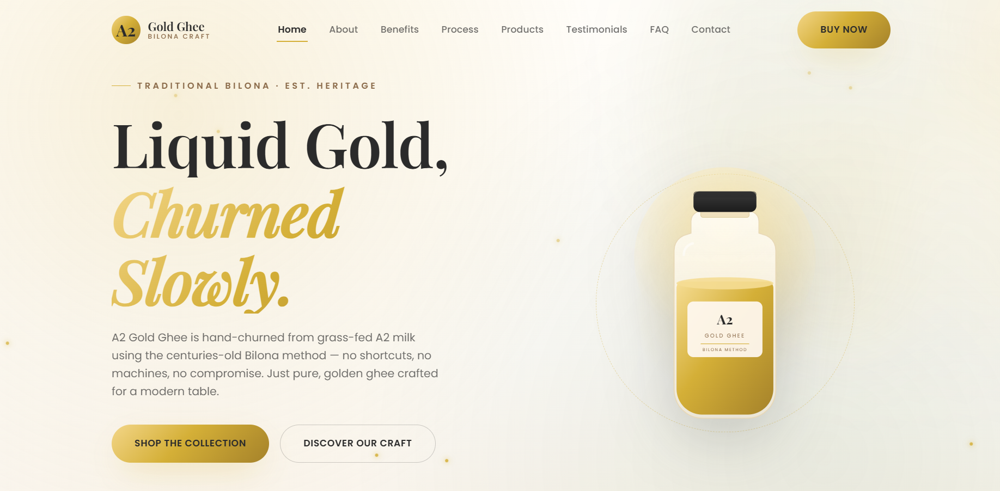
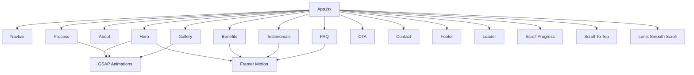
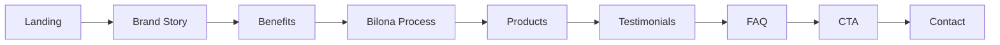

# ✨ A2 Gold Ghee

### Premium • Traditional • Pure • Modern

A premium, fully responsive one-page landing website for **A2 Gold Ghee**, created as a Frontend Developer interview assignment.

The project combines **modern React architecture, premium UI/UX, smooth scrolling, GSAP animations, Framer Motion interactions, and responsive Plain CSS** to create a polished luxury food-brand experience.

---

## 🌐 Live Preview

> Add your deployed website URL here.

**Live Demo:** `https://a2-gold-ghee.vercel.app`

---

## 📸 Preview

<p align="center">
  
</p>

---

# 🚀 Tech Stack

| Technology | Purpose |
|------------|---------|
| ⚛️ React 18 | Component-based UI architecture |
| ⚡ Vite | Fast development and production build |
| 🎨 Plain CSS | Responsive styling and design system |
| 🟢 GSAP | Advanced animations |
| 📜 ScrollTrigger | Scroll-based animations |
| 🎭 Framer Motion | Micro-interactions and UI animations |
| 🌀 Lenis | Smooth scrolling |
| 🔷 React Icons | UI icons |
| 🖥️ JavaScript ES6+ | Application logic |

### Design

| Area | Technology |
|------|------------|
| Typography | Playfair Display + Poppins |
| Layout | CSS Grid + Flexbox |
| Responsive Design | CSS Media Queries |
| Design Tokens | CSS Variables |
| Animation | GSAP + Framer Motion |
| Visual Style | Luxury / Editorial / Minimal |
| Accessibility | Semantic HTML + Reduced Motion |

---

# 🧩 Architecture

The application follows a modular component-based architecture.



---

# 🎯 Project Flow

The website is designed as a visual storytelling experience:



### User Journey

**Discover → Understand → Trust → Explore → Purchase → Connect**

---

# ✨ Features

| Feature | Description |
|---------|-------------|
| 🧭 Sticky Navbar | Navigation remains accessible while scrolling |
| 📱 Responsive UI | Desktop, tablet and mobile optimized |
| 🎬 Hero Animation | Premium entrance animation and product presentation |
| 🌀 Smooth Scroll | Lenis-powered smooth scrolling |
| 🎯 Scroll Animations | GSAP ScrollTrigger animations |
| 🫙 Product Showcase | 250ml, 500ml and 1L products |
| 🧈 Bilona Timeline | Animated traditional ghee-making process |
| 💬 Testimonials | Customer review section |
| ❓ FAQ | Animated accordion |
| 📩 Contact Form | Frontend-only contact interaction |
| 🔝 Scroll To Top | Floating back-to-top control |
| 📊 Scroll Progress | Visual page progress indicator |
| ⏳ Loader | Branded loading experience |
| ♿ Reduced Motion | Respects user motion preferences |

---

# 🎨 Design System

## Color Palette

| Color | Hex | Usage |
|-------|-----|-------|
| 🟡 Primary Gold | `#D4AF37` | Brand / CTA / Highlights |
| 🤍 Cream White | `#FFF9F2` | Main surfaces |
| 🟤 Warm Beige | `#F5E9D8` | Secondary sections |
| ⚫ Dark Charcoal | `#2B2B2B` | Typography |
| 🟫 Soft Brown | `#8B6B4A` | Supporting elements |
| 🟢 Natural Green | `#4F7A4A` | Organic accents |
| ⬜ Background | `#FCFAF7` | Page background |


---

# 🧱 Project Structure

```text
A2-Gold-Ghee/
│
├── public/
│   ├── favicon.png
│   └── ...
│
├── src/
│   │
│   ├── components/
│   │   │
│   │   ├── Navbar/
│   │   │   ├── Navbar.jsx
│   │   │   └── Navbar.css
│   │   │
│   │   ├── Hero/
│   │   │   ├── Hero.jsx
│   │   │   └── Hero.css
│   │   │
│   │   ├── About/
│   │   ├── Benefits/
│   │   ├── Process/
│   │   ├── Gallery/
│   │   ├── Testimonials/
│   │   ├── FAQ/
│   │   ├── CTA/
│   │   ├── Contact/
│   │   └── Footer/
│   │
│   ├── assets/
│   │   ├── images/
│   │   └── icons/
│   │
│   ├── animations/
│   │
│   ├── App.jsx
│   ├── main.jsx
│   └── index.css
│
├── index.html
├── package.json
├── vite.config.js
└── README.md
```

---


# 📱 Responsive Strategy

The website is designed using a mobile-first approach.

```text
                    Responsive Layout
                           │
             ┌─────────────┼─────────────┐
             │             │             │
          Desktop        Tablet        Mobile
          1440px+       768px+         <480px
             │             │             │
             ▼             ▼             ▼
          Multi-column   Reduced       Single-column
          layouts        spacing        layouts
```

### Responsive Techniques

- CSS Grid
- Flexbox
- Media Queries
- `clamp()`
- Fluid typography
- Responsive images
- Touch-friendly controls
- Mobile navigation
- No horizontal overflow

---

# 🧈 Traditional Bilona Process

The process section presents the traditional production journey:

```text
        🐄
     Indigenous Cow
          │
          ▼
      🥛 Fresh Milk
          │
          ▼
        Curd
          │
          ▼
       Butter
          │
          ▼
   Traditional Bilona
      Churning
          │
          ▼
     Slow Heating
          │
          ▼
      🟡 Pure Ghee
```

Each stage is animated using **GSAP ScrollTrigger**.

---

# 🫙 Product Collection

| Size | Positioning |
|------|-------------|
| 250ml | Everyday / Trial |
| 500ml | Family Size |
| 1L | Premium / Value |

Each product card includes:

- Product image
- Product name
- Description
- Price
- CTA
- Hover animation
- Image zoom
- Golden glow

---

# 📂 Component Architecture

Every major section is isolated into its own component.

```text
Navbar
   ↓
Hero
   ↓
About
   ↓
Benefits
   ↓
Process
   ↓
Gallery
   ↓
Testimonials
   ↓
FAQ
   ↓
CTA
   ↓
Contact
   ↓
Footer
```

This makes the application:

- Easy to maintain
- Easy to debug
- Easy to scale
- Easy to explain during an interview
- Easy to modify independently

---

# ⚡ Performance

The project focuses on:

- Lightweight dependencies
- Lazy-loaded images
- Optimized animations
- CSS-based effects where possible
- Responsive images
- Reduced-motion support
- Minimal unnecessary re-renders
- Vite production optimization

---

# 🛠️ Getting Started

## 1. Clone the repository

```bash
git clone https://github.com/GokulakrishnanSivalingam/a2-gold-ghee.git
```

## 2. Navigate into the project

```bash
cd a2-gold-ghee
```

## 3. Install dependencies

```bash
npm install
```

## 4. Start development server

```bash
npm run dev
```

The application will run at:

```text
http://localhost:5173
```

## 5. Build for production

```bash
npm run build
```

## 6. Preview production build

```bash
npm run preview
```

---


# 👨‍💻 Development Philosophy

The project follows four main principles:

```text
             A2 GOLD GHEE
                   │
       ┌───────────┼───────────┐
       │           │           │
      UI         CODE        UX
       │           │           │
   Premium      Clean      Intuitive
   Design       React      Navigation
       │           │           │
       └───────────┼───────────┘
                   │
             RESPONSIVE
                   │
              EXPERIENCE
```

### Core Focus

**Clean Code + Premium Design + Smooth Animation + Responsive UX**

---

# ⭐ Interview Highlights

This project demonstrates:

- React component architecture
- Modern CSS
- Responsive web development
- GSAP animation development
- ScrollTrigger
- Framer Motion
- Smooth scrolling with Lenis
- UI/UX implementation
- Accessibility
- Performance awareness
- Clean project organization
- Production-oriented development

---

## 📄 License

This project was created for educational and interview-assignment purposes.

© 2026 A2 Gold Ghee. All rights reserved.